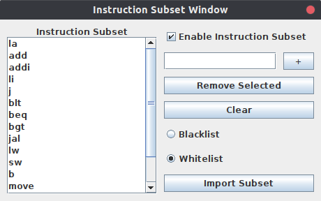

Additional Features User Manual
===============================

The additional features include the Phobos Menu (with 5 new features)
and the Auto Layout feature which is accessible directly from an icon on
the main GUI or from the Edit menu.

-   Phobos Menu
    -----------

    The **Phobos** menu in MARS is accessible on the top menu bar to the
    right of **Help**. From the dropdown menu, you will find the
    following features.

    1.  ### Comma Constraint

        Tick the checkbox **Comma Constraint** to enable this feature.
        When enabled, this feature strictly requires commas to be used
        in instructions and arrays for the program to assemble.

        Example usage:

              addi $t1 $t0 1    # This line will NOT assemble because of the lack of commas
              addi $t1, $t0, 1  # This line WILL assemble because it has the correct number of commas

        Note that if the Comma Constraint feature were to be disabled,
        the above two lines would both assemble.

    2.  ### Register Name Constraint

        Tick the checkbox **Register Name Constraint** to enable this
        feature. When enabled, this feature strictly requires register
        names to be used, rather than register numbers, for the program
        to assemble.

        Example usage:

              addi $1, $0, 1    # This line will NOT assemble because register numbers are being used
              addi $t1, $t0, 1  # This line WILL assemble because register names are being used

        Note that if the Register Name Constraint feature were to be
        disabled, the above two lines would both assemble (albeit, the
        first line would then be using possibly different registers than
        intended).

    3.  ### Offset Constraint

        Tick the checkbox **Offset Constraint** to enable this feature.
        When enabled, this feature strictly requires an offset to be
        used when using the **lw** or **sw** instructions.

        Example usage:

              lw $t0, ($t1)    # This line will NOT assemble because there is not an offset
              lw $t0, 0($t1)   # This line WILL assemble because an offset is supplied

    4.  ### Show Register Usage

        Tick the checkbox **Show Register Usage on Assemble** to enable
        this feature. When enabled, this feature will show a popup
        window when a program is successfully assembled. The popup
        window will have multiple tabs that one can select (or move
        between using the **arrow keys**) to see bar charts on the
        amount of registers that the assembled program contains.

        Example usage:

        

        The above image shows the usage of temporary registers. Using
        this image alone, one can see how many of each temporary
        registers are used within the program. According to the image,
        the program contains six \$t3 registers, one \$t2 register, and
        zero \$t8 registers.

    5.  ### Instruction Subset

        Select the option **Instruction Subset ...** to bring up the
        following dialog window:

        

        This feature can be enabled by ticking the **Enable Instruction
        Subset** checkbox. When enabled, this feature allows one to use
        a whitelist or blacklist to determine what subset of
        instructions can or can not be used, respectively. Any
        instructions that are currently in the subset are displayed in
        the list on the left.

        -   #### Add Instruction

            To add an instruction, simply type in any valid instruction
            into the text box at the top right and then press the **+**
            button. If the instruction is invalid, a warning will pop up
            and the instruction will not be added to the subset.

        -   #### Removed Selected

            To remove a selected instruction first select any amount of
            instructions. Specific instructions can be selected by
            clicking on them in the subset. To select more than one
            contiguous instruction hold **Shift** and click down to the
            last instruction to be selected. To deselect a specific
            instruction that you have selected, hold **Ctrl** and click
            the instruction. One can also hold **Ctrl** to pick more
            than one instruction that is not contiguous.

            Once the instruction(s) in the subset to be removed have
            been selected, press the **Remove Selected** button to
            remove them.

        -   #### Clear

            To clear all instructions from the subset, press the
            **Clear** button.

        -   #### Blacklist/Whitelist

            If **Blacklist** is selected, then all instructions in the
            subset are effectively "banned" from being used within the
            program. If any instructions that are in the subset are
            used, then the program will not assemble.

            If **Whitelist** is selected, then all instructions in the
            subset are the only ones allowed to be used within the
            program. If any instructions that are **NOT** in the subset
            are used, then the program will not assemble.

        -   #### Import Subset

            To import specific instructions from a text file, press the
            **Import Subset** button. One must have a text file (\*.txt
            extension only) prepared beforehand. Within this text file,
            any instructions one would like to add to the subset must be
            entered each on their own line. Any invalid instructions
            entered will be ignored and not added to the subset.

            Example text file:

                  add
                  addi
                  lw
                  jal

            When importing a text file, a prompt will appear asking
            whether to **Overwrite** or **Add**. To overwrite the
            current instruction subset with the instructions being
            imported, select the **Overwrite** button. To add the
            instructions from the text file to the existing instruction
            subset, select the **Add** button. Duplicate instructions do
            not have to be worried about as duplicates are filtered out.

-   ### Auto Layout Feature

    There are three ways one can use the Auto Layout feature in MARS
    while editing a file:

    -   Go to **Edit** -\> **Auto Layout**
    -   Press the Auto Layout icon in the
        icon menu below the top menu bar
    -   Press **Ctrl** + **Q**
